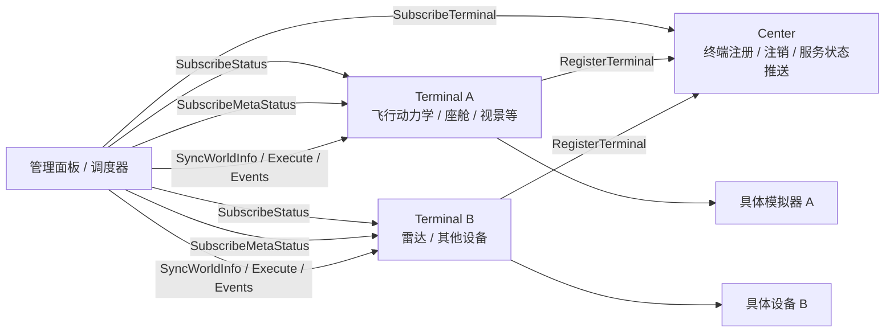
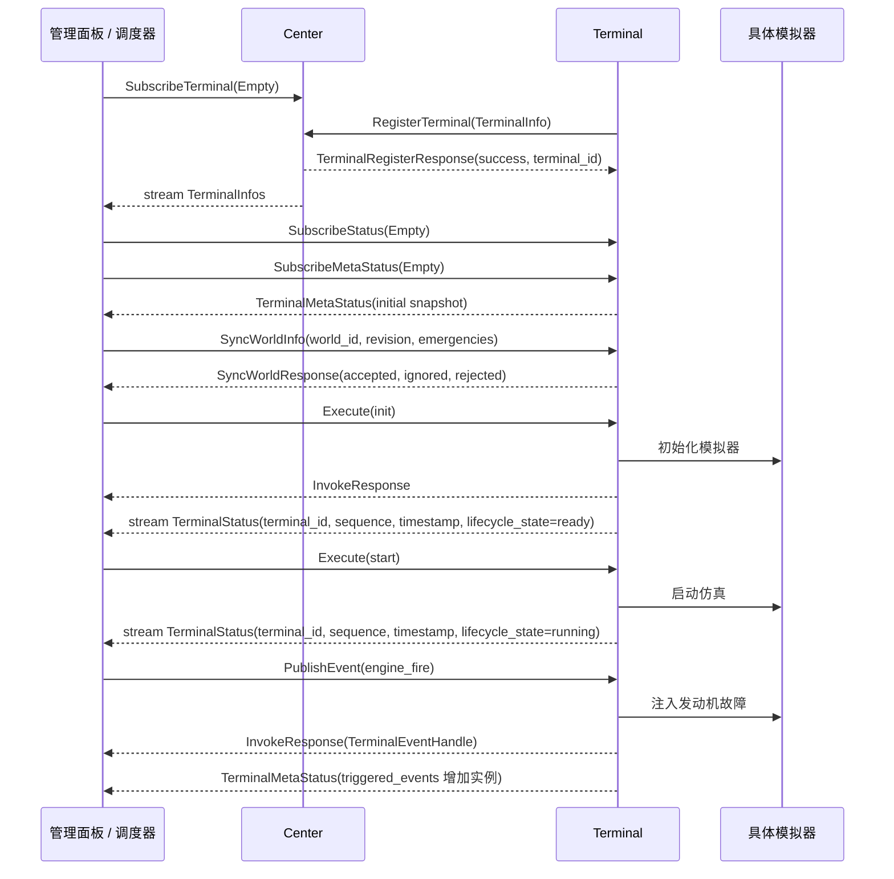
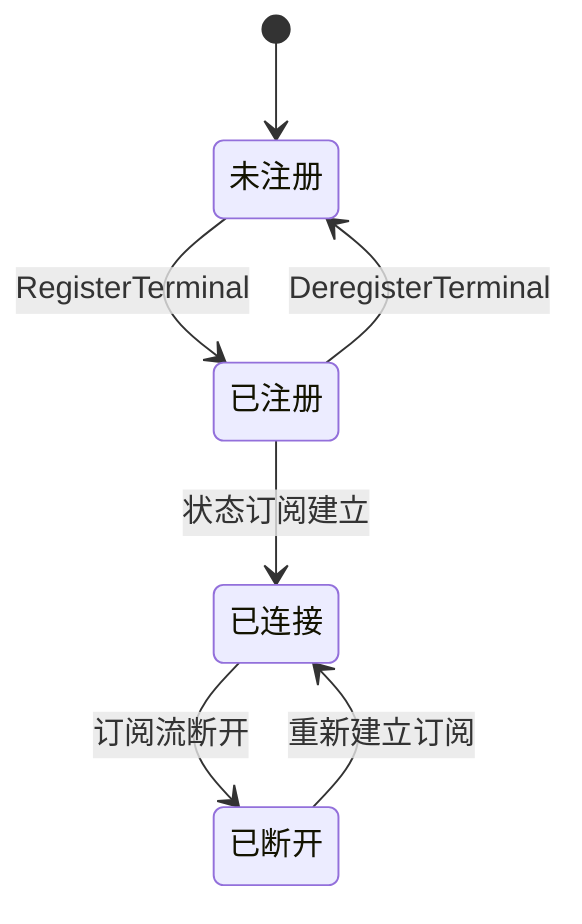
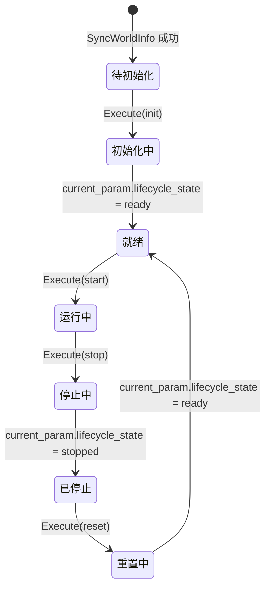

## 什么是控制系统

我通常把控制系统理解为一套“观察状态、做出判断、发出指令并修正结果”的机制。它会先获取被控制对象的当前状态，例如位置、速度、姿态、温度或任务进度；然后将这些状态和期望目标进行比较；最后通过某种执行机构或软件指令，让系统逐步靠近期望状态。

在我看来，一个典型的控制系统往往包含三个部分：输入、控制器和输出。输入描述系统当前发生了什么，控制器负责根据规则、算法或人工指令做决策，输出则作用到具体对象上。比如恒温空调会读取当前温度，和设定温度比较后决定是否制冷；自动驾驶仪会读取飞机姿态、高度和航向，再调整舵面或油门，使飞机保持在预定航迹上。

放到飞行仿真的场景里，我不太愿意把控制系统只看成几个按钮或命令接口，而是更愿意把它看成连接仿真模型、任务流程、设备状态和人工操作的一层协调机制。它既要能表达“我希望系统变成什么状态”，也要能持续感知“系统现在处于什么状态”，并在二者不一致时进行调度和修正。

在这篇设计思考里，我关注的主要目标是总体仿真控制。因此我希望这套控制系统承担的不只是单一对象的控制逻辑，还包括多个模拟器的接入与协同、各模拟器自身状态的管理，以及整个仿真任务运行状态的管理。

也就是说，我更倾向于把它设计成分布式仿真系统中的调度中枢，让各个仿真节点在统一的任务流程和状态约束下协同运行。

## 控制系统必要的特点

在设计总体仿真控制系统时，我最关心的不是功能堆得足够多，而是它能不能稳定、清晰地组织一次仿真的完整生命周期。我希望操作者能够知道当前系统处于什么状态，也希望各个仿真节点能够明确自己接下来应该做什么。

首先，我认为控制系统必须有清晰的状态模型。这里的状态既包括单个模拟器的状态，也包括整个仿真任务的全局状态。比如某个模拟器可能处于未连接、已连接、初始化中、运行中、暂停或故障状态；而整个仿真任务则可能处于准备、运行、暂停、结束或异常终止状态。如果没有统一的状态定义，使用者就很难判断一个控制命令当前是否可以执行，也很难在异常发生时把系统恢复到可理解的状态。

其次，我希望控制系统有统一的命令入口和控制权管理。启动、暂停、继续、重置、退出等命令看起来简单，但在分布式系统中，这些命令往往会同时影响多个节点。因此我需要保证命令的来源清晰、执行顺序明确，并且尽量避免多个控制端同时发出相互冲突的指令。

第三，我会特别关注时序一致性。飞行仿真通常不是单个程序独立运行，而是多个模型、设备或服务共同推进仿真过程。控制命令什么时候下发、各节点什么时候切换状态、数据什么时候开始交换，都可能影响最终仿真结果。因此，我希望总控系统尽量保证关键操作在时间和顺序上是可控的。

第四，我认为控制系统必须具备良好的可观测性。操作者不应该只看到一个“正在运行”的粗略结果，而应该能够看到各个模拟器是否在线、当前处于什么阶段、是否有错误、是否存在响应超时等信息。对于复杂仿真系统来说，我会把日志、状态上报、心跳检测和错误提示看成基础能力，而不是附加功能。

最后，我还会把可扩展性和容错能力放进基础设计里。随着仿真规模扩大，系统中可能会接入新的模拟器、新的计算节点或新的交互设备。因此我不希望控制系统的接口和某一个具体模拟器强绑定，而是尽量通过统一协议或适配层完成接入。同时，当某个节点异常退出或通信中断时，我也希望总控系统能够及时感知，并给出停止、重连、隔离或降级运行等处理策略。

概括起来，我希望一个合格的仿真控制系统至少能回答三个问题：现在系统在哪里，接下来系统要去哪里，以及如果中间出了问题应该如何处理。

在这些特点中，我最看重的是调度的确定性。这里的“确定性”不是要求每一次仿真都在完全相同的真实时间内完成，而是要求控制系统在相同初始条件、相同配置和相同控制命令下，能够按照可预期的顺序推进仿真流程。哪些节点先初始化，哪些节点必须等待依赖项就绪，暂停命令需要等待哪些模块进入安全状态，重置时哪些状态需要先清理，都应该由明确的调度规则决定，而不是依赖消息到达的偶然顺序或人工操作经验。

在分布式飞行仿真里，我最担心的就是同一个操作在不同运行中产生不同结果：有时某个模拟器已经进入运行状态，另一个模拟器还没有完成初始化；有时数据链路已经开始发送数据，但接收端尚未准备好。这类问题通常很难复现，也会削弱测试和排故的可靠性。因此，我希望总控系统把关键流程设计成可判定的状态迁移和阶段同步，例如启动前的就绪检查、运行前的统一放行、暂停时的同步屏障、异常时的统一处置策略。

所以在我的设计里，调度确定性可以看作控制系统可靠性的核心。它让系统行为可预测，让问题可复现，也让后续扩展新的模拟器或节点时仍然能够维持清晰的运行秩序。

## 分布式飞行仿真系统的特点

我理解的分布式飞行仿真系统，核心特点是把原本可能集中在一个程序中的模型、设备和交互过程拆分到多个独立节点上。每个节点可能负责不同的仿真职责，例如飞行动力学计算、视景显示、座舱仪表、操纵负荷、任务环境、外部载荷或数据记录。它们共同组成一次完整的仿真，但每个节点又都有自己的运行进程、状态机、计算周期和通信方式。

首先，我面对的是明显的异构性。不同模拟器可能由不同语言、不同框架或不同团队开发，对外暴露的接口、启动方式和状态定义也不完全相同。有的模块更接近实时计算程序，有的模块更像显示或交互终端，还有的模块只是提供数据服务。因此，我不能假设所有节点都以完全一致的方式工作，而需要通过统一协议、适配层或状态抽象来屏蔽这些差异。

其次，我认为分布式飞行仿真对时间关系非常敏感。飞行动力学、控制输入、视景刷新和仪表显示之间存在明确的先后关系。如果某个节点的数据提前、滞后或丢失，操作者看到的仿真结果就可能和真实计算状态不一致。这里的时间同步不一定只指严格的物理时钟同步，也包括仿真步长、数据帧序号、状态切换阶段和事件触发顺序的一致。

第三，我会把节点之间的数据耦合当成设计重点。飞行动力学模型的输出会影响视景、仪表和任务系统，操纵设备的输入又会反过来影响飞行动力学模型。也就是说，某个节点的问题往往不会停留在本地，而会通过数据链路传递到其他节点。分布式系统看起来是“多个部分独立运行”，但从仿真结果上看，它们又必须表现得像一个整体。

第四，我不能忽略通信本身带来的不确定性。网络延迟、消息乱序、连接中断、节点响应变慢等问题，在单机程序中可能不存在，但在分布式仿真里会直接影响控制流程。因此，我不能只假设命令发出后所有节点都会立即成功执行，而需要处理确认、超时、重试、失败回报和异常分支。

最后，我还需要考虑系统较长的生命周期和较高的扩展需求。随着仿真任务变化，系统可能不断接入新的模型、设备或外部系统。如果早期没有设计清晰的节点边界、状态约定和调度规则，后续每增加一个节点都会增加整体控制复杂度，也会让问题定位变得越来越困难。

因此，我认为分布式飞行仿真系统的难点并不只是“把多个程序连接起来”，而是要让这些独立节点在时间、状态、数据和控制流程上形成一致的整体。这也是为什么我在前面反复强调状态模型、调度确定性和可观测性。

## 设计方案

结合当前的接口设计，我选择把控制系统拆成三个主要部分：控制中心 `Center`、控制终端 `Terminal`，以及面向操作者或任务系统的管理面板/调度器。`Center` 负责终端注册、注销和服务状态监控；`Terminal` 负责把具体模拟器适配成统一的控制接口；管理面板或调度器则直接订阅 `Terminal` 的运行状态，并据此发起确定性的控制流程。

在这个设计里，`Center` 不承担运行时状态的汇聚职责。它只关心终端有没有注册、当前服务是否健康。真正的高频运行状态，由管理面板/调度器直接到每个 `Terminal` 上去订阅。这样做的好处是减轻了中心的负载，也让状态路径更短、延迟更可控。



### Center：注册发现与服务状态监控

在这个方案里，`Center` 的定位更清晰了：它是整个控制系统的目录服务和健康监控点。控制终端启动后先向 `Center` 注册自己的地址、端口和能力信息；管理面板或调度器则通过 `Center` 订阅终端列表的变化，而不是逐个去轮询。

```protobuf
service Center {
  rpc RegisterTerminal(TerminalInfo) returns (TerminalRegisterResponse);
  rpc DeregisterTerminal(google.protobuf.StringValue) returns (control.InvokeResponse);
  rpc SubscribeTerminal(google.protobuf.Empty) returns (stream TerminalInfos);
}

message TerminalRegisterResponse {
  bool   success     = 1;
  string message     = 2;
  string terminal_id = 3;
}
```

`terminal_id` 由 `Center` 在注册成功时分配，用于标识本次终端注册实例。注册响应中的 `message` 只承载诊断信息，不再兼作 ID。这里还需要区分 `terminal_id` 和 `terminal_mac`：前者是控制系统内的运行时实例身份，后者用于关联承载终端的物理或虚拟设备。设备地址变化或终端进程重启后，二者的生命周期并不相同。

`SubscribeTerminal` 返回的是终端列表流，每个终端附带一个 `grpc.health.v1.HealthCheckResponse.ServingStatus` 字段，用来表达服务是否可用。当有新终端注册、旧终端注销、或者某个终端的服务健康状态发生变化时，这个流都会推送更新。这样管理面板可以知道“现在系统里有哪些终端”以及“它们的服务状态是否正常”，但不需要 `Center` 去关心每个终端内部的具体运行参数。

对我来说，注册信息里最关键的是 `TerminalInfo`。它不仅包含终端的网络位置，也包含终端支持的类型和命令能力。

```protobuf
message TerminalInfo {
  string terminal_host = 1;
  uint32 terminal_port = 2;
  string terminal_mac  = 3;
  TerminalMetaInfo meta_info = 4;
}

message TerminalMetaInfo {
  TerminalType supported_type = 1;
  google.protobuf.Any extra_info = 2;
}

message TerminalType {
  string type_name = 1;
  string description = 2;
  string icon_url = 3;
  map<string, ParameterType> param_schema = 4;
  repeated TerminalCommandInfo supported_commands = 5;
}
```

目前一个终端只注册一个类型，这是我刻意保持的简单模型。`param_schema` 描述了终端运行时会对外暴露哪些参数，比如位置、姿态、速度、生命周期状态等；`supported_commands` 则描述了终端支持哪些命令，每个命令还可以带自己的参数定义和展示用的图标、描述。`TerminalMetaInfo.extra_info` 目前留作扩展，后续可以用来存放类型相关的额外信息，例如模拟器特有的 `sim_id` 等。一个终端扮演什么角色、支持哪些配置项、支持哪些控制命令，都可以在注册阶段暴露给 `Center`。`terminal_mac` 则用于在网络层面标识这台终端设备，避免 IP 变化导致身份混乱。后续管理面板可以根据这些元信息动态生成操作入口，调度器也可以根据能力信息判断某个仿真流程是否能够执行。

### Terminal：模拟器的统一适配层

我把 `Terminal` 定位为具体模拟器和控制系统之间的适配层。不同模拟器内部实现可以完全不同，但对外需要提供统一的控制接口，包括世界同步、命令执行、事件发布、事件取消、状态订阅和元状态订阅。

```protobuf
service Terminal {
  rpc SyncWorldInfo(WorldInfo) returns (SyncWorldResponse);
  rpc Execute(Command) returns (InvokeResponse);
  rpc PublishEvent(TerminalEvent) returns (InvokeResponse);
  rpc CancelEvent(TerminalCancelEvent) returns (InvokeResponse);
  rpc SubscribeStatus(google.protobuf.Empty) returns (stream TerminalStatus);
  rpc SubscribeMetaStatus(google.protobuf.Empty) returns (stream TerminalMetaStatus);
}
```

在执行生命周期命令之前，控制系统需要先通过 `SyncWorldInfo` 向相关终端同步本次任务的完整世界快照。这里的全局信息既包括世界级运行参数，也包括由控制系统统一定义的特情目录。

```protobuf
message WorldInfo {
  uint64                     timestamp    = 1;
  uint64                     world_id     = 2;
  map<string, Parameter>     global_param = 3;
  repeated TerminalEventInfo emergencies  = 4;
  uint64                     revision     = 5;
}

message SyncWorldResponse {
  bool                        success                = 1;
  repeated TerminalEventInfo  rejected_emergencies = 2;
  uint64                      world_id               = 3;
  uint64                      revision               = 4;
  repeated string             accepted_emergency_ids = 5;
  repeated string             ignored_emergency_ids  = 6;
  map<string, string>         rejected_reasons       = 7;
}
```

`WorldInfo` 是原子安装的完整快照，而不是增量补丁。`revision` 在同一个 `world_id` 内严格递增：相同版本的重试按幂等成功处理，旧版本会被拒绝；只有整个快照校验通过后，终端才替换本地保存的全局参数和特情目录。异构终端不一定能执行所有特情，因此同步响应会区分接受、忽略和拒绝三种结果。不适用于当前终端的特情可以被忽略；定义非法或本地能力异常导致的拒绝则会使本次同步失败，并保留上一个完整快照。只有所有关键终端都成功安装同一个 `world_id` 和 `revision` 后，调度器才进入初始化阶段。

在这些接口里，我会把 `Execute` 看成最核心的控制入口。命令被设计成动态结构，通过 `id` 标识命令类型，通过 `payload` 携带参数。

```protobuf
message Command {
  string id = 1;
  uint64 request_id = 2;
  int64 timestamp = 3;
  map<string, Parameter> payload = 4;
}
```

这里我想多说几句 `Parameter` 的设计。对于动态参数，常见的做法是使用 `google.protobuf.Any` 配合 gRPC 反射插件，这样任何消息类型都可以直接传递，灵活性很高。但在这个系统里，我更希望控制终端在注册阶段就把参数结构声明清楚，这样控制系统不需要依赖运行时反射，就能根据 `ParameterType` 直接生成命令表单、校验输入、展示状态面板。所以我用了一个强类型的 oneof 结构，`WorldInfo.global_param`、`Command.payload` 和 `TerminalEvent.payload` 都用它：

```protobuf
message Parameter {
  message Simple {
    oneof value {
      string string_value = 1;
      int64  int_value    = 2;
      double double_value = 3;
      bool   bool_value   = 4;
    }
  }
  message SubTable {
    map<string, Parameter> table = 1;
  }
  message Selected {
    repeated string options = 1;
  }
  oneof value {
    Simple   simple_value    = 1;
    SubTable sub_table_value = 2;
    Selected selected_value  = 3;
  }
}
```

基础类型有字符串、整数、浮点和布尔；`SubTable` 支持嵌套结构；`Selected` 则是一组已选中的字符串选项。`ParameterType` 在注册阶段描述每个参数应该是什么类型，会出现在 `TerminalType` 的 `param_schema` 和 `supported_commands[].parameter` 中，和运行时的 `Parameter` 一一对应。这样控制系统就能在不了解终端内部实现的情况下，理解命令需要哪些参数、状态会返回哪些字段。

```protobuf
message ParameterType {
  enum Type { STRING = 0; INT = 1; DOUBLE = 2; BOOL = 3; }
  message Select { repeated string options = 1; }
  message SubTable { map<string, ParameterType> schema = 1; }
  oneof value {
    Type     type      = 1;
    Select   select    = 2;
    SubTable sub_table = 3;
  }
}
```

对于要做可视化面板或者自动化调度脚本的场景，这种结构信息非常必要。

在基础命令方面，按照接口约定，终端至少应支持 `init`、`reset`、`start`、`stop`、`suspend`、`resume`。`init` 的参数需要和注册时声明的命令参数一致；`reset`、`start`、`stop` 同理。不过对于核心的仿真生命周期调度，我目前只把 `init`、`start`、`stop`、`reset` 纳入状态机。`suspend` 和 `resume` 作为辅助能力保留，后续如果调度流程需要再引入，不急于现在就把它们画进主状态图里。

`Command.timestamp` 是命令生成时的毫秒级 Unix 时间戳，只用来记录发生时间和辅助排序；可靠的重试去重由 `request_id` 负责。它在当前 `world_id` 和目标 `terminal_id` 范围内对新请求单调递增，同一命令重试时必须复用原 ID。终端需要缓存已处理请求及其结果，让重复请求返回相同结果而不再次执行。这里的墙上时钟也不应和状态参数中的 `sim_time_ms` 混淆，后者表示仿真世界内部的时间。

我想在这里把命令和事件再区分清楚一些。命令是终端在任意状态下都会向外部提供的行为入口，它描述的是“这个终端能接收哪些控制动作”。这些能力通常在注册阶段通过 `TerminalType.supported_commands` 一次性声明，不会因为当前状态而改变。`init` 在没初始化时可以执行、`start` 在就绪后可以执行、`stop` 在运行后可以执行，这些是由状态机守卫条件（guards）决定的，不是由注册信息动态增减的。换句话说，命令是稳定的控制接口，调度器可以预期某个终端一定支持哪些命令。

事件则不同。`TerminalEventInfo` 描述事件定义，`TerminalMetaStatus.publishable_events` 是终端在当前状态下允许控制系统触发的事件定义完整快照。这个集合会随状态变化，但事件最终仍由活动调度器通过 `PublishEvent` 发起，终端不会自主触发事件。事件触发后产生的运行时实例则记录在 `triggered_events` 中。

如果把启动流程抽象出来，我会用下面这样的 C++ 伪代码来表达：

```cpp
bool RunSimulation(const SimulationPlan& plan) {
  control::WorldInfo world_info;
  world_info.set_world_id(plan.world_id);
  world_info.set_revision(plan.revision);
  world_info.set_timestamp(GetCurrentTimestampMs());
  FillWorldParameters(plan, world_info.mutable_global_param());
  FillEmergencyDefinitions(plan, world_info.mutable_emergencies());

  // 所有关键终端先安装同一个世界快照，形成配置屏障
  for (const auto& item : plan.terminals) {
    auto sync_resp = item.terminal->SyncWorldInfo(world_info);
    if (!sync_resp.success()) {
      LOG_ERROR("world sync failed on terminal: %s", item.id.c_str());
      return false;
    }
  }

  // 按初始化顺序逐个执行 init
  for (const auto& item : plan.init_order) {
    control::Command cmd;
    cmd.set_id("init");
    cmd.set_request_id(NextRequestId(plan.world_id, item.id));
    cmd.set_timestamp(GetCurrentTimestampMs());
    // 把该终端对应的配置参数放进 payload，这里用一个 SubTable 来承载
    // 假设 plan.config[item.id] 是 map<string, Parameter>
    auto& config_param = (*cmd.mutable_payload())["config"];
    auto* table = config_param.mutable_sub_table_value()->mutable_table();
    for (const auto& kv : plan.config.at(item.id)) {
      table->insert({kv.first, kv.second});
    }

    auto resp = item.terminal->Execute(cmd);
    if (!resp.success()) {
      LOG_ERROR("init failed on terminal: %s", item.id.c_str());
      return false;
    }

    if (!WaitUntilStatus(item.id, "ready", plan.timeout_ms)) {
      LOG_ERROR("terminal %s did not reach ready in time", item.id.c_str());
      return false;
    }
  }

  // 按启动顺序逐个执行 start
  for (const auto& item : plan.start_order) {
    control::Command cmd;
    cmd.set_id("start");
    cmd.set_request_id(NextRequestId(plan.world_id, item.id));
    cmd.set_timestamp(GetCurrentTimestampMs());

    auto resp = item.terminal->Execute(cmd);
    if (!resp.success()) {
      LOG_ERROR("start failed on terminal: %s", item.id.c_str());
      return false;
    }

    if (!WaitUntilStatus(item.id, "running", plan.timeout_ms)) {
      LOG_ERROR("terminal %s did not reach running in time", item.id.c_str());
      return false;
    }
  }

  return true;
}
```

这段代码的重点不是具体实现，而是表达一种思路：调度规则必须显式化。哪些终端先初始化，哪些状态必须等待，哪些命令可以并行，哪些命令必须串行，都应该由 `SimulationPlan` 决定，而不是依赖消息到达的偶然顺序。

### 状态通道：高频状态与低频元状态

状态通道分为两类：`TerminalStatus` 和 `TerminalMetaStatus`。前者用于描述终端运行过程中的高频状态，后者用于描述终端允许被触发的事件集合、已触发事件实例等元信息。这里的“低频”不是指固定周期推送，而是指它只在内容发生变化时才推送，平时不产生额外流量。

```protobuf
message TerminalStatus {
  string terminal_id = 1;
  uint64 sequence = 2;
  int64 timestamp = 3;
  map<string, Parameter> current_param = 4;
}

message TerminalMetaStatus {
  string terminal_id = 1;
  repeated TerminalEventInfo publishable_events = 2;
  map<uint64, string> triggered_events = 3;
}
```

`TerminalStatus` 里保留了 `terminal_id`，这样每条状态消息都是自描述的。即使管理面板同时订阅多个 Terminal，或者在日志、回放、转发等场景下脱离了订阅流上下文，也能直接知道这条状态来自哪个终端。`sequence` 和 `timestamp` 则用于跟踪状态顺序和发生时间。我没有在 `TerminalStatus` 里放通用的在线状态字段，因为这个控制系统的终端不全是模拟器，还可能有雷达、数据记录、任务环境等其他类型的节点。如果强制加入一个统一的“是否在线”字段，反而会让通用性变差。终端是否可达，可以通过 gRPC 订阅流是否保持连接来判断；而对于模拟器终端，我会在 `current_param` 里用标准字段来表达业务状态，例如：

```json
{
  "lifecycle_state": { "simple_value": { "string_value": "ready" } },
  "entity_health": { "simple_value": { "int_value": 100 } },
  "sim_time_ms": { "simple_value": { "int_value": 120000 } },
  "frame": { "simple_value": { "int_value": 3600 } }
}
```

这些字段并不处在同一个约束层级。`lifecycle_state` 是控制系统能够推进统一生命周期的基础，所有参与 `init`、`start`、`stop`、`reset` 调度的终端都必须提供；`entity_health`、`sim_time_ms`、`frame` 则是类型相关字段，分别描述模拟实体健康度、仿真时间和帧序号，不适用的终端可以省略。使用 `entity_health` 而不是笼统的 `health`，也是为了避免和 gRPC 服务健康状态混淆。

这些约定需要在注册阶段显式声明。终端应把适用字段写入 `TerminalType.param_schema`，并标明对应类型。管理面板可以根据 schema 通用渲染类型相关状态，不需要预先了解每一种终端；调度器则会有意识地识别 `lifecycle_state` 这类 well-known key，并在准入阶段检查必需字段是否存在、类型是否正确。换句话说，动态 schema 减少的是类型相关界面的硬编码，并没有消除控制协议自身的必要约定。

这种“约定加注册声明”的做法当然也有代价：字段名是否正确、类型是否匹配，没法靠 proto 编译器来保证，调度器读取状态时也要多做一次 map 查找和类型校验。所以自然会想到另一个方案，直接把 `lifecycle_state`、`entity_health`、`sim_time_ms`、`frame` 提升为 `TerminalStatus` 的 `optional` proto 字段。这个方案的好处很直接：关键状态字段一目了然，调度代码可以 `status.lifecycle_state()` 直接访问，编码也更紧凑。

两种方式没有绝对的对错，只是取舍不同。我把它们放在一起对比：

| 维度             | 放在 `current_param` 中（当前设计）                                                  | 提升为 `TerminalStatus` 的 `optional` 字段                                                                        |
| ---------------- | ------------------------------------------------------------------------------------ | ----------------------------------------------------------------------------------------------------------------- |
| 通用性           | 好。公共消息只提供状态容器，生命周期约定和各类终端的专有字段都可以通过 schema 表达。 | 较弱。每固化一个类型相关字段，所有终端都会继承这份并不一定适用的消息定义。                                        |
| 扩展性           | 好。新增标准字段只需改约定和注册 schema，不改 proto。                                | 差。每加一个标准字段就要改 `TerminalStatus` 的 proto 定义，虽然加 `optional` 是向后兼容的，但会让消息越来越臃肿。 |
| 类型一致性       | 好。命令、事件、状态、注册 schema 都走同一套 `Parameter` / `ParameterType` 系统。    | 差。状态字段被拆成两部分：一部分是 proto 强类型字段，一部分是动态 `Parameter`，系统需要维护两套解析逻辑。         |
| 与注册信息的关联 | 自然。适用字段统一在 `TerminalType.param_schema` 中声明，管理面板按注册信息渲染。    | 变弱。字段存在于 proto，不代表某类终端会提供它，仍需额外声明适用性。                                              |
| 编译期约束       | 弱。字段名是否正确、类型是否匹配，主要靠注册声明和运行时校验。                       | 强。`status.lifecycle_state()` 是编译期可见的，代码更直接。                                                       |
| 调度器代码清晰度 | 一般。需要查 map，例如 `current_param.at("lifecycle_state")`。                       | 好。直接访问字段即可，省去一次 map 查找和类型断言。                                                               |
| 编码效率         | 稍低。map 的 string key 会带来额外字节。                                             | 更高。字段按 tag 编码，没有 key 开销。                                                                            |
| 可读性/调试      | 稍差。看一条状态消息时，标准字段混在 map 里。                                        | 更好。关键字段一目了然。                                                                                          |

综合看下来，我更看重左侧这些优势。即使 `lifecycle_state` 是稳定的控制约定，把它和类型相关字段都放在 `current_param` 中，仍能让状态值和 `param_schema` 保持单一表达方式，避免客户端同时维护固定字段和动态字段两套解析路径。将来如果实践证明某个字段对所有终端都长期稳定且性能敏感，仍可以单独评估是否提升为 proto 字段；当前阶段先保留统一的动态结构更合适。

聊完高频状态，再来看看另一类状态通道：`TerminalMetaStatus`。

`TerminalMetaStatus` 不需要包含 `current_type` 字段。因为一个终端只注册一个类型，管理面板通过 `Center.SubscribeTerminal` 就能拿到终端类型信息，没必要在元状态里重复。它主要承载两件事：一是终端当前允许被触发的事件列表，二是已经由控制系统触发、终端正在执行的事件实例列表。

其中 `triggered_events` 是一个 `map<uint64, string>`，key 是事件的运行时实例 ID（`instance_id`），value 是事件 ID。这个设计是为了让控制系统可以区分同一个事件被多次触发的情况，例如两次独立的“发动机故障”事件，各自有不同的 `instance_id`，取消时也能精确对应到某一次。

`TerminalMetaStatus` 的推送策略和 `TerminalStatus` 不同：订阅建立时，终端先发送当前完整快照；此后只有允许被触发的事件集合或已触发事件实例发生变化时，才推送新的完整快照。没有变化时不产生额外流量。高频的 `TerminalStatus` 推送频率由终端实现控制，目前约定最大不超过 100Hz。

### 一次典型控制流程

按照这个分工，我会把一次典型的控制流程分成注册、订阅、世界同步、初始化、启动、事件触发和状态反馈几个阶段。



在这个流程里，`Center` 只解决“有哪些终端”和“它们的服务是否健康”的问题；`Terminal` 解决“如何控制具体模拟器”和“高频运行状态是什么”的问题；管理面板/调度器解决“在什么时机同步哪个世界、对哪些终端下发什么命令”的问题。状态路径不经过 Center 转发，调度器可以直接根据每个终端的状态流判断下一步动作。

这里暂时采用单写入者模型：可以有多个面板订阅状态，但同一时刻只有一个活动调度器能够调用 `SyncWorldInfo`、`Execute`、`PublishEvent` 和 `CancelEvent`。多控制端并发写入需要额外的租约、leader 或会话令牌机制，本文先把它保留为后续设计边界。

### 状态迁移与确定性调度

为了保证调度确定性，我不希望控制系统只把命令当成普通 RPC 调用，而是要把每个命令都放进状态迁移中理解。不过注册连接状态和业务生命周期是两个正交维度，不应该混在同一张状态图里。

首先是注册与连接状态：



然后是业务生命周期：



`TerminalStatus.terminal_id` 让每条状态都可溯源，`sequence` 则在同一终端注册实例内单调递增。通信层负责“通不通”，Center 的服务健康负责“服务是否可用”，`lifecycle_state` 负责“业务处于哪个阶段”。一旦订阅流断开，调度器冻结该终端的业务推进并进入异常策略；重新建立订阅后，再根据最新状态判断是继续、回滚还是终止，而不是把业务生命周期直接改成 `Disconnected`，也不需要因为一次普通断线重新注册。

在实现时，我可以为每个阶段设置明确的进入条件和退出条件。例如只有所有关键终端都完成注册并进入 `ready` 状态后，调度器才统一下发 `start`；如果某个终端超时没有进入预期状态，调度器就进入异常处理流程，而不是继续向后执行。

### 事件机制

除了生命周期命令，接口中还保留了事件发布和取消能力。

```protobuf
message TerminalEvent {
  string event_id = 1;
  uint64 trigger_delay_ms = 2;
  uint64 repeat_period_ms = 3;
  map<string, Parameter> payload = 4;
}

message TerminalCancelEvent {
  string event_id = 1;
  uint64 instance_id = 2;
}
```

我会把事件机制用于描述那些不一定改变整体生命周期、但会影响仿真过程的动作，例如改变环境条件、注入任务事件或启动某个定时行为。和命令不同，事件的可触发性会随状态变化：某个环境事件可能只在仿真运行时才允许触发，某个任务事件可能在特定阶段才出现。终端通过 `TerminalMetaStatus.publishable_events` 告诉控制系统“当前我可以触发哪些事件”，管理面板据此动态展示可用事件列表，避免用户在不可触发的事件上误操作。

`trigger_delay_ms` 可以描述延迟触发，`repeat_period_ms` 可以描述周期性事件。事件发布成功后，`InvokeResponse` 的 `message` 字段里会返回事件句柄，包含该事件的运行时实例 ID，后续可以用这个 ID 精确取消某一次事件实例。

这里用 C++ 伪代码来表达一次事件发布和取消：

```cpp
// 发布一个 5 秒后触发的发动机故障事件
control::TerminalEvent event;
event.set_event_id("engine_fire");
event.set_trigger_delay_ms(5000);
event.set_repeat_period_ms(0);
(*event.mutable_payload())["level"].mutable_simple_value()->set_int_value(3);

auto resp = terminal->PublishEvent(event);
if (!resp.success()) {
  LOG_ERROR("publish event failed");
  return;
}

// 从响应中解析出 TerminalEventHandle，拿到 instance_id
control::TerminalEventHandle handle;
if (!resp.message().UnpackTo(&handle)) {
  LOG_ERROR("failed to unpack event handle");
  return;
}
uint64_t instance_id = handle.instance_id();

// 如果需要取消这次事件
control::TerminalCancelEvent cancel;
cancel.set_event_id("engine_fire");
cancel.set_instance_id(instance_id);
terminal->CancelEvent(cancel);
```

这里需要明确一个边界：`TerminalEventInfo` 里除了 `event_id`，还有 `event_type`、`event_category`、`event_name`、`description` 和 `payload_schema`，分别用于标识事件类型、事件分类、展示名称、详细描述和参数定义。控制系统可以根据 `event_type` 和 `event_category` 来区分普通事件、关键事件和特情事件。

普通事件和关键事件可以由终端根据当前状态通过 `publishable_events` 暴露可触发集合，例如环境变化、任务事件或普通故障演示，但最终触发仍然由控制系统通过 `PublishEvent` 发起。终端只负责报告“当前状态下哪些事件允许被触发”，而不是自主决定何时触发。

特情类事件则完全不同。它由控制系统统一定义，并在初始化前通过 `SyncWorldInfo` 随完整世界快照同步到各个终端。这样特情的语义和参数结构由控制系统统一维护，终端只负责校验、安装并在运行阶段执行。具体流程可以分为两步：

1. **初始化前同步定义**：控制系统把本次任务涉及的特情目录放入 `WorldInfo.emergencies`，向所有相关终端同步同一个 `world_id` 和 `revision`。终端通过 `SyncWorldResponse` 返回接受、忽略和拒绝项；只有所有关键终端都成功安装快照后，调度器才允许进入 `init`。
2. **运行阶段精确触发**：终端把已安装且满足当前状态守卫条件的特情加入 `publishable_events`。控制系统根据训练脚本或人工指令，只对这个集合中的项目调用 `PublishEvent`。

为什么特情不能由终端自行定义？因为特情训练的核心是“可控且可复现”。如果每个终端都能自己声明 `engine_fire`、`hydraulic_failure` 这类事件，不同终端对同一个特情的命名、参数、触发条件很可能不一致，训练脚本就无法跨终端复用，事后回放和评估也会失去统一依据。更危险的是，终端可能在高优先级场景下自行触发特情，干扰控制系统的调度决策。因此终端实现中不需要也不应该去定义 `emergency` 类型的特情事件。

还需要区分的是**告警**。告警在语义上是终端根据自身状态发现的事实，例如发动机温度超限、液压压力不足等；它不属于事件机制，也不应该通过 `PublishEvent` 触发。事件是控制系统“让系统发生什么”，告警是终端“告诉系统发生了什么”，两者的发起方向和语义都不相同。当前这组接口尚未定义告警上报通道，因此这里只明确概念边界，后续再决定使用状态快照承载当前告警，还是增加独立的告警流。

### 小结

总体来看，这套接口设计已经具备分布式仿真控制系统的基本骨架：`Center` 负责发现和健康监控，`Terminal` 负责世界同步、适配执行和状态推送，活动调度器直接订阅终端状态并发起确定性控制流程。原子世界快照让全局参数和特情目录拥有一致基线，状态通道的拆分让高频运行状态和变化驱动的元信息各得其所，强类型的 `Parameter` 让命令和状态可以被理解和校验，事件实例化则让同类型事件的多次触发可以被精确管理。

不过我也很清楚，以我自己设定的标准来衡量，这套设计目前只搭起了“确定性调度”的意图，机制层面还有几个明显的缺口：

第一，跨终端的原子性目前靠调度器的编排循环，而不是协议机制。单个终端的快照安装是原子的，但如果一部分终端装上了新版本、另一部分拒绝了，系统就会进入混合版本状态，协议里还没有回滚或“安装但未激活”的两段式原语。对一个把确定性当核心主张的系统来说，最关键的多节点转换恰恰是目前保证最弱的环节。

第二，“统一放行”还缺少物理机制。逐终端串行下发 `start`，各终端的实际启动时刻必然存在网络往返级别的偏差。要真正兑现前文强调的时序一致性，后续需要引入定时生效命令或 arm+trigger 两段式设计，甚至配套的时间同步服务。

第三，调度器是全系统状态最多的组件——`request_id` 计数、世界版本、各终端的状态机镜像、计划执行进度都集中在它手里，但它的持久化和故障恢复还没有被当作一等设计对象。协议目前也只有流式订阅、没有一元查询，调度器重启后如何重建全局视图，这条恢复路径实际上还不存在。

第四，可复现的前提是有历史。`triggered_events` 只反映当前存活的事件实例，命令与事件都没有审计日志，断线期间的状态也会直接丢失。回放和评估需要一个专门的记录组件来承载控制面日志，它现在还不在架构图里。

第五，`Terminal` 名义上是薄适配层，实际要承担快照存储、请求去重、事件调度、状态守卫求交等一整套运行时职责。如果不配套一个统一的终端侧运行时库，各团队自行实现这些语义，行为分歧会在架构最想统一的地方重新长出来。

第六，单写入者目前只是假设而非机制，而 `request_id` 的作用域设计又把这个假设固化进了协议。将来教员站的人工干预和自动化脚本调度并存时，需要连同幂等模型一起重新设计控制权，而不是简单补一个租约就能解决。

这些缺口不妨碍接口在当前阶段继续演进，但它们决定了这套系统能否从“能控制”走向“可信赖”。加上尚未设计的告警通道和 `Center` 的注册租约与高可用，这些会是下一阶段的重点。只有当每一次仿真的推进路径都是可解释的、可追踪的、可复现的，这个控制系统才称得上稳定。
