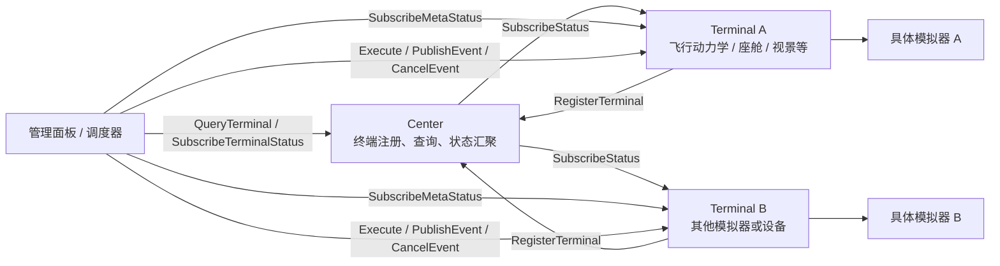
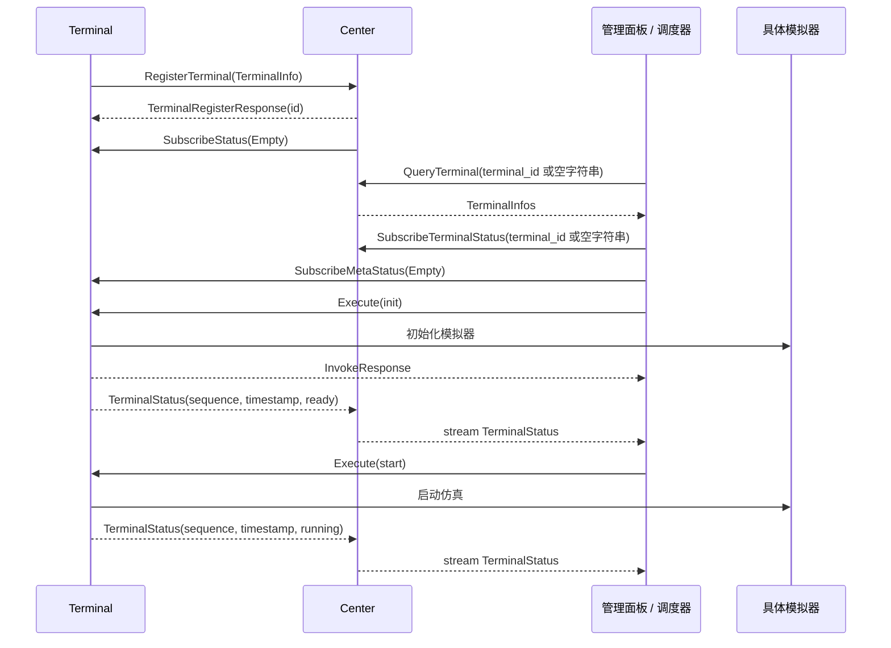
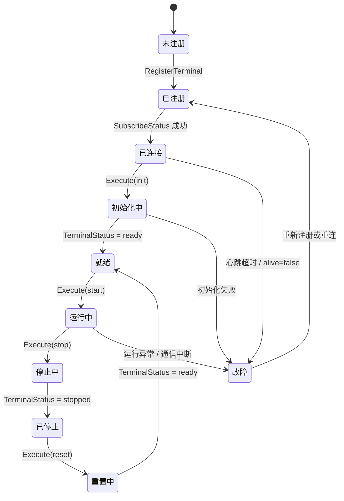

## 什么是控制系统

我通常把控制系统理解为一套“观察状态、做出判断、发出指令并修正结果”的机制。它会先获取被控制对象的当前状态，例如位置、速度、姿态、温度或任务进度；然后将这些状态和期望目标进行比较；最后通过某种执行机构或软件指令，让系统逐步靠近期望状态。

在我看来，一个典型的控制系统往往包含三个部分：输入、控制器和输出。输入描述系统当前发生了什么，控制器负责根据规则、算法或人工指令做决策，输出则作用到具体对象上。比如恒温空调会读取当前温度，和设定温度比较后决定是否制冷；自动驾驶仪会读取飞机姿态、高度和航向，再调整舵面或油门，使飞机保持在预定航迹上。

放到飞行仿真的场景里，我不太愿意把控制系统只看成几个按钮或命令接口，而是更愿意把它看成连接仿真模型、任务流程、设备状态和人工操作的一层协调机制。它既要能表达“我希望系统变成什么状态”，也要能持续感知“系统现在处于什么状态”，并在二者不一致时进行调度和修正。

在这篇设计思考里，我关注的主要目标是总体仿真控制。因此我希望这套控制系统承担的不只是单一对象的控制逻辑，还包括多个模拟器的接入与协同、各模拟器自身状态的管理，以及整个仿真任务运行状态的管理。

也就是说，我更倾向于把它设计成分布式仿真系统中的调度中枢，让各个仿真节点在统一的任务流程和状态约束下协同运行。

## 控制系统必要的特点

在设计总体仿真控制系统时，我最关心的不是功能堆得足够多，而是它能不能稳定、清晰地组织一次仿真的完整生命周期。我希望操作者能够知道当前系统处于什么状态，也希望各个仿真节点能够明确自己接下来应该做什么。

首先，我认为控制系统必须有清晰的状态模型。这里的状态既包括单个模拟器的状态，也包括整个仿真任务的全局状态。比如某个模拟器可能处于未连接、已连接、初始化中、运行中、暂停或故障状态；而整个仿真任务则可能处于准备、运行、暂停、结束或异常终止状态。如果没有统一的状态定义，使用者就很难判断一个控制命令当前是否可以执行，也很难在异常发生时把系统恢复到可理解的状态。

其次，我希望控制系统有统一的命令入口和控制权管理。启动、暂停、继续、重置、退出等命令看起来简单，但在分布式系统中，这些命令往往会同时影响多个节点。因此我需要保证命令的来源清晰、执行顺序明确，并且尽量避免多个控制端同时发出相互冲突的指令。

第三，我会特别关注时序一致性。飞行仿真通常不是单个程序独立运行，而是多个模型、设备或服务共同推进仿真过程。控制命令什么时候下发、各节点什么时候切换状态、数据什么时候开始交换，都可能影响最终仿真结果。因此，我希望总控系统尽量保证关键操作在时间和顺序上是可控的。

第四，我认为控制系统必须具备良好的可观测性。操作者不应该只看到一个“正在运行”的粗略结果，而应该能够看到各个模拟器是否在线、当前处于什么阶段、是否有错误、是否存在响应超时等信息。对于复杂仿真系统来说，我会把日志、状态上报、心跳检测和错误提示看成基础能力，而不是附加功能。

最后，我还会把可扩展性和容错能力放进基础设计里。随着仿真规模扩大，系统中可能会接入新的模拟器、新的计算节点或新的交互设备。因此我不希望控制系统的接口和某一个具体模拟器强绑定，而是尽量通过统一协议或适配层完成接入。同时，当某个节点异常退出或通信中断时，我也希望总控系统能够及时感知，并给出停止、重连、隔离或降级运行等处理策略。

概括起来，我希望一个合格的仿真控制系统至少能回答三个问题：现在系统在哪里，接下来系统要去哪里，以及如果中间出了问题应该如何处理。

在这些特点中，我最看重的是调度的确定性。这里的“确定性”不是要求每一次仿真都在完全相同的真实时间内完成，而是要求控制系统在相同初始条件、相同配置和相同控制命令下，能够按照可预期的顺序推进仿真流程。哪些节点先初始化，哪些节点必须等待依赖项就绪，暂停命令需要等待哪些模块进入安全状态，重置时哪些状态需要先清理，都应该由明确的调度规则决定，而不是依赖消息到达的偶然顺序或人工操作经验。

在分布式飞行仿真里，我最担心的就是同一个操作在不同运行中产生不同结果：有时某个模拟器已经进入运行状态，另一个模拟器还没有完成初始化；有时数据链路已经开始发送数据，但接收端尚未准备好。这类问题通常很难复现，也会削弱测试和排故的可靠性。因此，我希望总控系统把关键流程设计成可判定的状态迁移和阶段同步，例如启动前的就绪检查、运行前的统一放行、暂停时的同步屏障、异常时的统一处置策略。

所以在我的设计里，调度确定性可以看作控制系统可靠性的核心。它让系统行为可预测，让问题可复现，也让后续扩展新的模拟器或节点时仍然能够维持清晰的运行秩序。

## 分布式飞行仿真系统的特点

我理解的分布式飞行仿真系统，核心特点是把原本可能集中在一个程序中的模型、设备和交互过程拆分到多个独立节点上。每个节点可能负责不同的仿真职责，例如飞行动力学计算、视景显示、座舱仪表、操纵负荷、任务环境、外部载荷或数据记录。它们共同组成一次完整的仿真，但每个节点又都有自己的运行进程、状态机、计算周期和通信方式。

首先，我面对的是明显的异构性。不同模拟器可能由不同语言、不同框架或不同团队开发，对外暴露的接口、启动方式和状态定义也不完全相同。有的模块更接近实时计算程序，有的模块更像显示或交互终端，还有的模块只是提供数据服务。因此，我不能假设所有节点都以完全一致的方式工作，而需要通过统一协议、适配层或状态抽象来屏蔽这些差异。

其次，我认为分布式飞行仿真对时间关系非常敏感。飞行动力学、控制输入、视景刷新和仪表显示之间存在明确的先后关系。如果某个节点的数据提前、滞后或丢失，操作者看到的仿真结果就可能和真实计算状态不一致。这里的时间同步不一定只指严格的物理时钟同步，也包括仿真步长、数据帧序号、状态切换阶段和事件触发顺序的一致。

第三，我会把节点之间的数据耦合当成设计重点。飞行动力学模型的输出会影响视景、仪表和任务系统，操纵设备的输入又会反过来影响飞行动力学模型。也就是说，某个节点的问题往往不会停留在本地，而会通过数据链路传递到其他节点。分布式系统看起来是“多个部分独立运行”，但从仿真结果上看，它们又必须表现得像一个整体。

第四，我不能忽略通信本身带来的不确定性。网络延迟、消息乱序、连接中断、节点响应变慢等问题，在单机程序中可能不存在，但在分布式仿真里会直接影响控制流程。因此，我不能只假设命令发出后所有节点都会立即成功执行，而需要处理确认、超时、重试、失败回报和异常分支。

最后，我还需要考虑系统较长的生命周期和较高的扩展需求。随着仿真任务变化，系统可能不断接入新的模型、设备或外部系统。如果早期没有设计清晰的节点边界、状态约定和调度规则，后续每增加一个节点都会增加整体控制复杂度，也会让问题定位变得越来越困难。

因此，我认为分布式飞行仿真系统的难点并不只是“把多个程序连接起来”，而是要让这些独立节点在时间、状态、数据和控制流程上形成一致的整体。这也是为什么我在前面反复强调状态模型、调度确定性和可观测性。

## 目前的设计方案

结合当前的接口设计，我选择把控制系统拆成三个主要部分：控制中心 `Center`、控制终端 `Terminal`，以及面向操作者或任务系统的管理面板/调度器。`Center` 负责终端注册、终端查询和状态汇聚；`Terminal` 负责把具体模拟器适配成统一的控制接口；管理面板或调度器则根据状态和元信息发起确定性的控制流程。



### Center：注册发现与状态汇聚

在这个方案里，我把 `Center` 看成整个控制系统的目录服务和状态汇聚点。控制终端启动后先向 `Center` 注册自己的地址、端口和能力信息；管理面板或调度器再通过 `Center` 查询当前有哪些终端可用，并订阅这些终端的状态变化。

```protobuf
service Center {
  rpc RegisterTerminal(TerminalInfo) returns (TerminalRegisterResponse);
  rpc UnregisterTerminal(google.protobuf.StringValue) returns (control.InvokeResponse);
  rpc QueryTerminal(google.protobuf.StringValue) returns (TerminalInfos);
  rpc SubscribeTerminalStatus(google.protobuf.StringValue) returns (stream TerminalStatus);
}
```

对我来说，注册信息里最关键的是 `TerminalInfo`。它不仅包含终端的网络位置，也包含终端支持的模拟类型和命令能力。

```protobuf
message TerminalInfo {
  repeated TerminalMetaInfo meta_info = 1;
  string terminal_host = 2;
  uint32 terminal_port = 3;
}

message TerminalMetaInfo {
  repeated TerminalType supported_type = 1;
}

message TerminalType {
  string type_name = 1;
  string description = 2;
  string icon_url = 3;
  repeated TerminalCommandInfo supported_commands = 4;
}
```

我这样设计的好处是，控制系统不需要在代码里写死每一种模拟器的能力。一个终端支持哪些机型、哪些配置项、哪些控制命令，都可以在注册阶段暴露给 `Center`。后续管理面板可以根据这些元信息动态生成操作入口，调度器也可以根据能力信息判断某个仿真流程是否能够执行。

### Terminal：模拟器的统一适配层

我把 `Terminal` 定位为具体模拟器和控制系统之间的适配层。不同模拟器内部实现可以完全不同，但对外需要提供统一的控制接口，包括命令执行、事件发布、事件取消、状态订阅和元状态订阅。

```protobuf
service Terminal {
  rpc Execute(Command) returns (control.InvokeResponse);
  rpc PublishEvent(TerminalEvent) returns (control.InvokeResponse);
  rpc CancelEvent(google.protobuf.StringValue) returns (control.InvokeResponse);
  rpc SubscribeStatus(google.protobuf.Empty) returns (stream TerminalStatus);
  rpc SubscribeMetaStatus(google.protobuf.Empty) returns (stream TerminalMetaStatus);
}
```

在这些接口里，我会把 `Execute` 看成最核心的控制入口。在当前接口里，我把命令设计成动态结构，通过 `id` 标识命令，通过 `payload` 携带参数。

```protobuf
message Command {
  string id = 1;
  string type = 2;
  int64 timestamp = 5;
  map<string, Any> payload = 6;
}
```

虽然我采用的是动态命令设计，但我希望终端至少支持 `init`、`reset`、`start`、`stop`、`update` 这几个基础命令。这样可以保证不同模拟器即使内部差异很大，也能纳入统一的仿真生命周期管理。如果后续需要暂停、继续、保存快照等能力，我也可以通过 `supported_commands` 扩展，而不需要改变基础服务结构。

如果把启动流程抽象出来，我会认为它接近下面这样的伪代码：

```typescript
async function runSimulation(plan: SimulationPlan) {
  for (const terminal of plan.initOrder) {
    await terminal.execute({ id: "init", payload: plan.config[terminal.id] });
    await waitUntilStatus(terminal.id, "ready", plan.timeoutMs);
  }

  for (const terminal of plan.startOrder) {
    await terminal.execute({ id: "start", payload: {} });
    await waitUntilStatus(terminal.id, "running", plan.timeoutMs);
  }
}
```

这段逻辑的重点不是代码形式本身，而是我需要把调度规则显式化：哪些终端先初始化，哪些状态必须等待，哪些命令可以并行，哪些命令必须串行，都应该由调度计划决定。

### 状态通道：高频状态与低频元状态

在当前接口里，我把状态通道拆成两类：`TerminalStatus` 和 `TerminalMetaStatus`。前者用于描述终端运行过程中的高频状态，后者用于描述终端的能力、类型和事件列表等低频元信息。

```protobuf
message TerminalStatus {
  string terminal_id = 1;
  bool alive = 2;
  string current_type_name = 3;
  map<string, Any> current_parameters = 6;
  uint64 sequence = 7;
  int64 timestamp = 8;
}

message TerminalMetaStatus {
  string terminal_id = 1;
  TerminalType current_type = 2;
  repeated TerminalEventInfo publishable_events = 3;
  repeated TerminalEventInfo triggered_events = 4;
}
```

我认为这个拆分是合理的。位置、姿态、速度、运行参数等信息可能变化很快，适合放在 `TerminalStatus` 中持续推送；当前机型、可发布事件、已触发事件等信息变化较慢，适合放在 `TerminalMetaStatus` 中低频推送，并在发生变化时立即推送。

从当前 `Center` 接口看，我只把 `SubscribeTerminalStatus` 对外提供给展示端，用来展示终端是否在线、当前参数和高频运行状态；展示端不需要直接关心终端支持哪些事件或当前类型如何变化。管理面板/调度器如果需要实时感知可发布事件列表或当前终端类型变化，则在通过 `Center` 查询到终端地址后，直接订阅对应 `Terminal` 的 `SubscribeMetaStatus`。这样，`Center` 只承担状态汇聚和发现职责，元状态仍由 `Terminal` 按需提供。

当然需要注意一点：如果控制系统要严格执行前文提到的状态模型，当前协议还需要约定终端生命周期状态的表达方式。例如可以先在 `current_parameters` 中约定一个标准字段：

```json
{
  "lifecycle_state": "ready",
  "sim_time_ms": 120000,
  "frame": 3600
}
```

如果后续状态模型稳定，我也可以把 `lifecycle_state` 从动态参数提升为显式字段或枚举。这样做可以减少不同终端对状态字符串的自由解释，让调度器更容易判断命令是否允许执行。

### 一次典型控制流程

按照这个分工，我会把一次典型的控制流程分成注册、发现、订阅、初始化、启动和状态反馈几个阶段。



在这个流程里，我让 `Center` 主要解决“有哪些终端”和“终端当前是什么状态”的问题；让 `Terminal` 解决“如何控制具体模拟器”的问题；让管理面板/调度器解决“在什么时机对哪些终端下发什么命令”的问题。三者职责分开后，系统更容易扩展，也更容易定位问题。

### 状态迁移与确定性调度

为了保证调度确定性，我不希望控制系统只把命令当成普通 RPC 调用，而是要把每个命令都放进状态迁移中理解。也就是说，`init`、`start`、`stop`、`reset` 等命令只有在特定状态下才允许执行，执行后也必须等待终端状态进入预期结果。这也是飞行仿真分布式系统和很多面向服务的分布式系统之间的一个重要区别：后者通常倾向于 **stateless** 的服务设计，而这里更接近 **stateful** 的流程控制。



在这个模型下，我在开发时可以为每个阶段设置明确的进入条件和退出条件。例如只有所有关键终端都完成注册并进入 `ready` 状态后，调度器才统一下发 `start`；如果某个终端超时没有进入预期状态，调度器就进入异常处理流程，而不是继续向后执行。

### 事件机制

除了生命周期命令，我在当前接口中还保留了事件发布和取消能力。

```protobuf
message TerminalEvent {
  string event_id = 1;
  uint64 trigger_delay_ms = 2;
  uint64 repeat_period_ms = 3;
  map<string, Any> payload = 4;
}
```

我会把事件机制用于描述那些不一定改变整体生命周期、但会影响仿真过程的动作，例如触发某个故障、改变环境条件、注入任务事件或启动某个定时行为。`trigger_delay_ms` 可以描述延迟触发，`repeat_period_ms` 可以描述周期性事件，`CancelEvent` 则用于取消已经发布但尚未结束的事件。

这里需要保持一个边界：普通终端可以通过 `publishable_events` 暴露自己支持的事件能力，但特情类事件更适合由控制系统统一定义和管理。这样可以避免终端内部实现和控制系统预定义的特情逻辑发生冲突，也有利于在不同训练任务中复用同一套特情脚本。

### 小结

总体来看，我认为当前接口设计已经具备分布式仿真控制系统的基本骨架：`Center` 负责发现和聚合，`Terminal` 负责适配和执行，状态订阅提供可观测性，命令与事件接口提供控制入口。后续真正影响系统可靠性的重点，是把动态命令、动态状态和动态事件进一步纳入统一的状态模型和调度规则中，让每一次仿真流程都可以被解释、被追踪、被复现。
